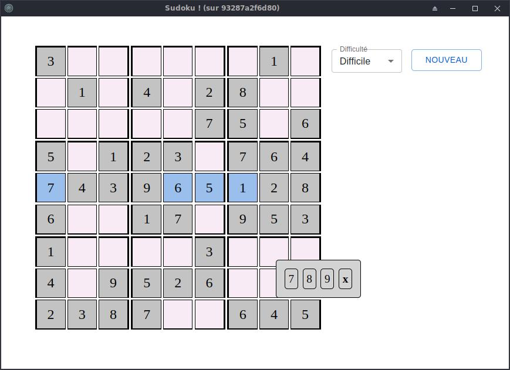

Sudoku
=======

Un jeu de sudoku avec Electron et React en TypeScript. 

# Features

* créer une nouvelle partie
* choisir le niveau de difficulté
* enregistrement automatique des parties

# À propos

Premier projet avec Electron, React et TypeScript. Il y a sûrement des points à améliorer. N'hésitez pas à me contacter pour toutes suggestions ;)

# Télécharger

## Git

Récupérer les sources avec git :

```sh
git clone git@github.com:pierrick-marie/sudoku.git
```

## Tarball

Vous pouvez télécharger un tarball [ici](https://github.com/pierrick-marie/sudoku/releases).

## Package

Utiliser le projet comme packahe npm en suivant les instructions [ici](https://github.com/pierrick-marie/sudoku/pkgs/npm/sudoku).

# Build

Depuis le code source du projet, installer les dépendances du projet avec la commande suivante : 

```sh
npm update
```

# Démarrer une partie

Pour lancer une partie, utiliser la commande suivante :

```sh
npm start
```



# Sources of Electron React Boiler plate

* [React boiler plate](https://github.com/electron-react-boilerplate/electron-react-boilerplate)

# Licence

BSD-3-Clause license